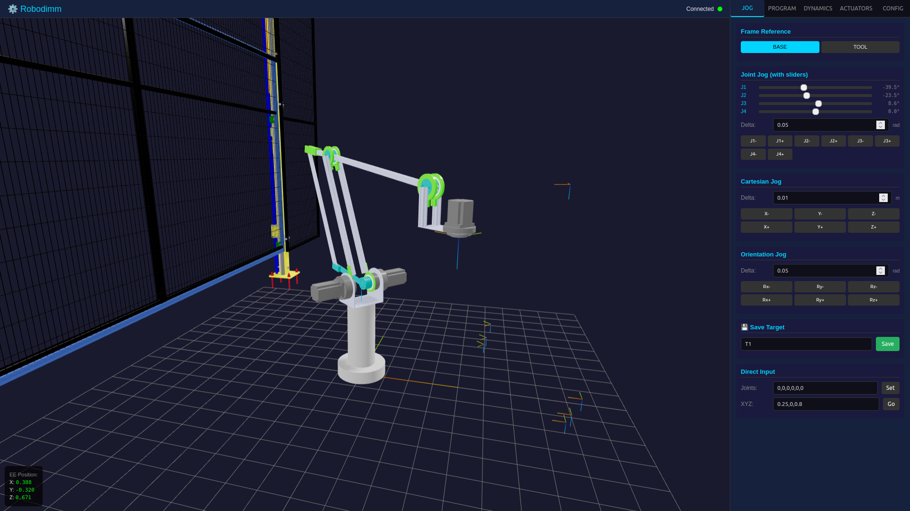

# Robodimm

Robodimm is a web application for robot motion programming, inverse dynamics, and actuator sizing for scalable industrial robots.

It provides:
- a frontend-only `DEMO` mode for rapid testing,
- a backend-enabled `PRO` mode using FastAPI, Pinocchio, and Pink,
- support for `CR4` palletizer and `CR6` 6-DOF robot models.

## Interface

The simulator combines robot visualization, target/program editing, dynamics analysis, and actuator sizing in a single workspace.



## Quick Start

### DEMO mode

```bash
python3 -m http.server 8080 --directory frontend
```

Open `http://localhost:8080/simulator.html?mode=demo`

### PRO mode

Preferred setup:

```bash
conda env create -f environment.yml
conda activate robodimm_env
```

Minimal setup:

```bash
pip install -r requirements.txt
```

Run:

```bash
uvicorn backend.main:app --reload --host 0.0.0.0 --port 8000
```

Open:
- `http://localhost:8000/`
- `http://localhost:8000/simulator?mode=pro`

Default development login:
- user: `admin`
- password: `robotics`

### Docker

```bash
cp .env.local .env
docker-compose up --build
```

## Main Capabilities

- joint and Cartesian jog
- target and program editing
- DEMO/PRO execution behind a common frontend workflow
- trajectory dynamics analysis and CSV export
- actuator library management and motor/gearbox selection
- CR4 dynamic configuration inputs including payload, friction, reflected inertia, motor layout, and structural scaling overrides

## Notes

- PRO mode is expected on port `8000`.
- DEMO clears local storage on load unless `?keep_saved=true` is used.
- The shared actuator library uses anonymized generic labels such as `AC_*` and `HD*`.
- Structural scaling parameters are configurable in the app; the paper case-study values are not hardcoded defaults.

## Project Layout

- `backend/`: FastAPI app and API routers
- `frontend/`: web UI and DEMO-side logic
- `robot_core/`: robot builders, conversions, dynamics, actuator logic
- `meshes/`: robot mesh assets
- `actuators_library.json`: shared backend actuator catalog

## Additional Docs

- `QUICK_START.md`
- `DEPLOYMENT.md`
## Publication

Robodimm is described in the following paper:

- J. L. Torres, M. Munoz, J. D. Alvarez, J. L. Blanco, and A. Gimenez, "Robodimm: A Physics-Grounded Framework for Automated Actuator Sizing in Scalable Modular Robots," arXiv:2603.06864, 2026.
- arXiv: `https://arxiv.org/abs/2603.06864`
- DOI: `https://doi.org/10.48550/arXiv.2603.06864`

### How to Cite

```bibtex
@article{torres2026robodimm,
  title   = {Robodimm: A Physics-Grounded Framework for Automated Actuator Sizing in Scalable Modular Robots},
  author  = {Torres, J. L. and Munoz, M. and Alvarez, J. D. and Blanco, J. L. and Gimenez, A.},
  journal = {arXiv preprint arXiv:2603.06864},
  year    = {2026},
  doi     = {10.48550/arXiv.2603.06864},
  url     = {https://arxiv.org/abs/2603.06864}
}
```
