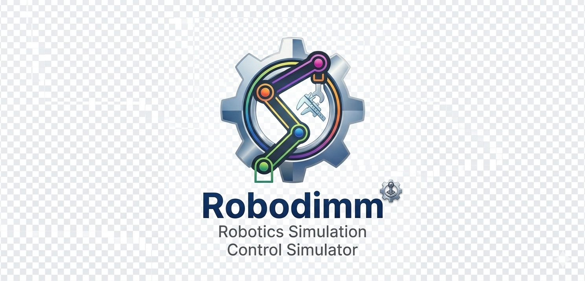
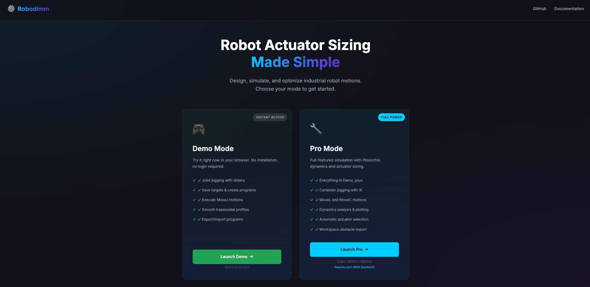
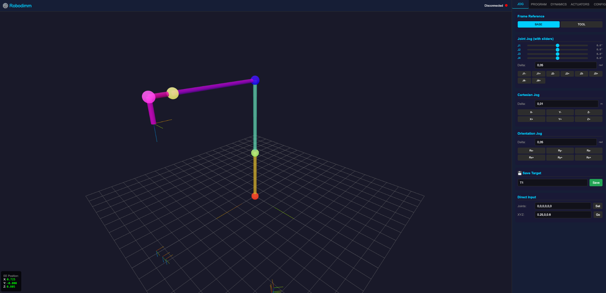

<p align="center">
  
</p>

<h1 align="center">Robodimm</h1>

<h3 align="center">Robot Actuator Sizing Made Simple</h3>

<p align="center">
  Design, simulate, and optimize industrial robot motions.<br/>
  Choose your mode to get started.
</p>

<p align="center">
  <a href="https://commit-zeb.es/robot/" target="_blank">
    
  </a>
</p>

<p align="center">
  <!-- Tests -->
  
  <!-- License -->
  
  <!-- Python -->
  
  <!-- Docker -->
  
  <!-- arXiv -->
  <a href="https://arxiv.org/abs/2603.06864">
    
  </a>
</p>

<p align="center">
  <!-- Pinocchio -->
  
  <!-- Pink -->
  
  <!-- FastAPI -->
  
  <!-- Three.js -->
  
  <!-- NumPy -->
  
</p>

---

Robodimm is a web application for robot motion programming, inverse dynamics, and automated actuator sizing for scalable industrial robots. It combines a physics-based backend with an interactive 3D frontend to provide an end-to-end toolchain: from trajectory specification to motor and gearbox selection.

Key features:
- **DEMO mode** — runs entirely in the browser, no server required.
- **PRO mode** — full physics backend via FastAPI + Pinocchio + Pink.
- **CR4** 4-DOF palletizer (parallelogram closed-loop) and **CR6** 6-DOF spherical-wrist robot models.
- Constrained inverse dynamics (KKT), actuator requirement analysis, and motor/gearbox selection.
- Geometric scaling laws for structural mass/inertia with configurable exponents.

## Live deployment

Try it now at **[https://commit-zeb.es/robot/](https://commit-zeb.es/robot/)**

[](https://commit-zeb.es/robot/)

## Interface

**DEMO mode** — browser-only simulation: joint jogging, target programming, and trapezoidal motion profiles:



**PRO mode demo** — real-time inverse dynamics, IK solver, and actuator sizing (click to play):

https://github.com/user-attachments/assets/f64398df-2905-4825-8aa7-872f37545386

## Quick Start

Robodimm has two operating modes with different requirements:

| | DEMO mode | PRO mode |
|---|---|---|
| Physics backend (Pinocchio, Pink) | ❌ browser only | ✅ required |
| Inverse dynamics (KKT) | ❌ | ✅ |
| IK solver (Pink QP) | ❌ | ✅ |
| REST API (FastAPI) | ❌ | ✅ |
| Installation required | none | Docker / Conda |

### DEMO mode — no installation required

All logic runs in the browser (JavaScript). No server or Python dependencies needed.

```bash
python3 -m http.server 8080 --directory frontend
```

Open `http://localhost:8080/simulator.html?mode=demo`

### PRO mode — full physics backend

**Docker (recommended)** — single command, no dependency management:

```bash
cp .env.local .env
docker compose up --build
```

Open `http://localhost:8000/` or `http://localhost:8000/simulator?mode=pro`

**Conda** — for development:

```bash
conda env create -f environment.yml
conda activate robodimm_env
uvicorn backend.main:app --reload --host 0.0.0.0 --port 8000
```

**pip** — minimal setup:

```bash
pip install -r requirements.txt
uvicorn backend.main:app --reload --host 0.0.0.0 --port 8000
```

Default login: `admin` / `robotics`

## Running the Tests

The test suite requires Pinocchio and Pink (included in `environment.yml` and the Docker image).

**Docker (recommended):**

```bash
docker compose build
docker compose run --rm robodimm micromamba run -n base pytest tests/ -v
```

**Conda:**

```bash
conda activate robodimm_env
pytest tests/ -v
```

The suite contains **214 unit tests** covering:

| Module | Tests | Coverage |
|---|---|---|
| `robot_core.interpolation` | 22 | Trapezoidal/linear profiles, multi-DOF trajectories |
| `robot_core.inertial_params` | 25 | Box/cylinder inertia, CR4 scaling laws |
| `robot_core.actuators` | 23 | Trajectory requirements, motor/gearbox selection |
| `robot_core.kinematics` | 22 | FK (forward kinematics), IK solver, `build_robot` |
| `robot_core.dynamics` | 15 | KKT constrained ID, trajectory dynamics, method comparison |
| `robot_core` conversions | 16 | Real ↔ Pink ↔ RobotStudio joint space round-trips |
| `backend.models` | 43 | Pydantic schema validation for all API endpoints |
| `backend.utils` | 22 | Coordinate conversions, demo targets, index mapping |

All tests pass in < 1 second on the Docker image (`Python 3.10`, `Pinocchio 3.x`, `Pink 4.x`).

## Project Layout

```
robodimm-main/
├── backend/          # FastAPI app and API routers
├── frontend/         # Web UI and DEMO-side logic (Three.js)
├── robot_core/       # Robot builders, kinematics, dynamics, actuators
│   ├── builders/     # CR4 and CR6 Pinocchio model builders
│   └── dynamics/     # Constrained ID, trajectory dynamics
├── tests/            # 214 unit tests (pytest)
├── meshes/           # Robot mesh assets (GLTF/GLB)
├── docs/             # Documentation and images
├── environment.yml   # Conda environment (Python 3.10 + Pinocchio + Pink)
├── Dockerfile        # Micromamba-based container
└── actuators_library.json  # Shared actuator catalog
```

## Main Capabilities

- Joint and Cartesian jog with real-time IK
- Target and program editing with MoveJ / MoveL / MoveC instructions
- DEMO/PRO execution behind a common frontend workflow
- Trajectory inverse dynamics (RNEA + KKT constraints) and CSV export
- Actuator library management and motor/gearbox selection with safety factors
- Geometric scaling of structural mass and inertia (configurable exponents)
- Payload, friction, reflected inertia, and motor stator mass configuration

## Notes

- PRO mode is expected on port `8000`.
- DEMO clears local storage on load unless `?keep_saved=true` is used.
- The shared actuator library uses anonymized generic labels such as `AC_*` and `HD*`.
- Structural scaling parameters are configurable in the app; the paper case-study values are not hardcoded defaults.

## Additional Docs

- [QUICK_START.md](QUICK_START.md)
- [DEPLOYMENT.md](DEPLOYMENT.md)

## Publication

Robodimm is described in the following paper:

> J. L. Torres, M. Munoz, J. D. Alvarez, J. L. Blanco, and A. Gimenez, "Robodimm: A Physics-Grounded Framework for Automated Actuator Sizing in Scalable Modular Robots," *arXiv:2603.06864*, 2026.

- arXiv: https://arxiv.org/abs/2603.06864
- DOI: https://doi.org/10.48550/arXiv.2603.06864

### How to Cite

```bibtex
@article{torres2026robodimm,
  title   = {Robodimm: A Physics-Grounded Framework for Automated Actuator Sizing in Scalable Modular Robots},
  author  = {Torres, J. L. and Munoz, M. and Alvarez, J. D. and Blanco, J. L. and Gimenez, A.},
  journal = {arXiv preprint arXiv:2603.06864},
  year    = {2026},
  doi     = {10.48550/arXiv.2603.06864},
  url     = {https://arxiv.org/abs/2603.06864}
}
```

## License

This project is licensed under the [MIT License](LICENSE).
